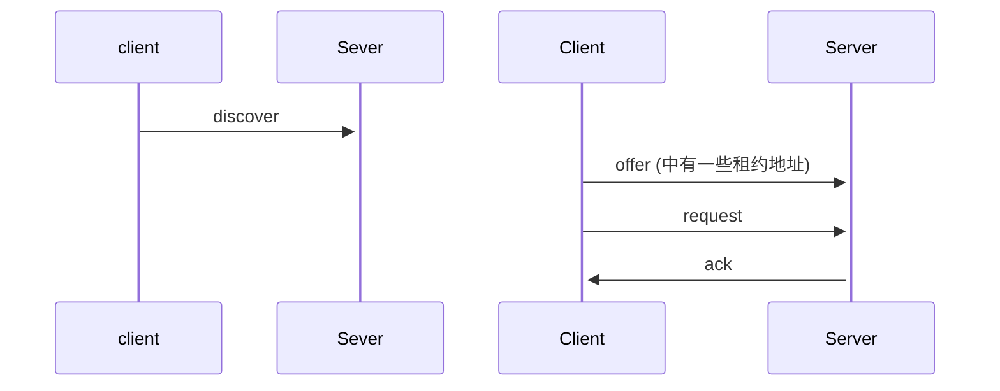

# 应用层
## DHCP 协议
Dynamic HOST .. Protrool 局域网DHCP 为客户机提供IP

##  HTTP 和 HTTPS协议

## kerberos 协议
client 和 server 之前的认证协议

双向认证 对暗号
第三方 KDC 认证
过程相当复杂

## NFS 网络文件系统
DNFS 分布式网络文件系统(hadoop)
stamp.io
## E-mail 
  
  SMTP(默认port: 25)
  发邮件
  POP(默认端口: 110)
  POP3协议
  读邮件  IMAP 

FFV window 下一个文件格式识别工具 ,通过查看图片头.

## DNS 服务器
### CName 
### ARecord 