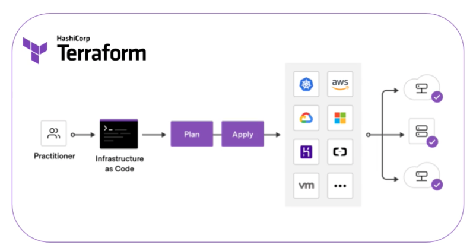

# AWS

公司最近开始在使用AWS我在这里记录一下每天使用的过程那么公司最近开始在使用AWS我在这里记录一下每天使用的过程.

## AWS CLI
 
 AWS命令行工具,自己使用时按照[官网](https://docs.aws.amazon.com/cli/latest/userguide/getting-started-install.html)给的方式下载就好了.
 自己公司里是搞到自己的私服了通过 pip intall aws-cli ,可能同官网的不一样.

 命令太多记不住,耗头发,使用的时候参考[手册](https://awscli.amazonaws.com/v2/documentation/api/latest/reference/index.html).
 同时也看看了别云服务上,[华为云CLI](https://support.huaweicloud.com/qs-hcli/hcli_02.html),[阿里云CLI](https://help.aliyun.com/product/29991.html) 用法都差不多,看的明白文档才是王道.
 之后会存一些常用命令

## ADFS

  这个其实就是我们自己实现的一个小工具,原理用python 就打开AWS的登陆页面输入账号密码,选择一个IAM账户,点击登录.
  有个你的session之后通过AWS CLI拿到token, 拿到token信息把aws账户的token写到本地的 ~/.aws/credentials中,大概这个样子

    ```
     [saml]
     output = json
     aws_access_key_id = dummy
     aws_access_key_id = dummy
     region = eu-west-1
     aws_sestion_token = dummy

    ```

## Infostruct as Code
IaC 是架构的蓝图,帮助你简单方便的管理aws架构.
 ### 介绍 terraform
 [官网](https://www.terraform.io/)     
 一门脚本语言, 目的是 Infostruct as Code(架构作为代码), 简单地说在使用aws的各种组件时一步一步的点击,一步步配置时间久了大家都记不住,所以搞成一些脚本,自己定义比变量,定义组件名字等. 统一管理方便快捷,高端大气有格调.
 [下载地址](https://www.terraform.io/downloads)
 ### 实践
 没什么废话就是,一个地址告诉这东西怎么用:[教程](https://learn.hashicorp.com/collections/terraform/aws-get-started)
 大概步骤:
 =
### AWS CloudFormation and AWS Cloud Development kit
除了Terroaform ,aws也提供了2中工具


## AWS IAM USER
IAM user 是 root user 创建的子用户,用ID or allias 登陆.
IAM 里可以配置用户组,没个组有一定的权限.
公司给开发都是IAM user的账户, 没有小小开发一般都没有root账户
同时也可以在这set up 一些 警报,来控制账户的话费,一旦到达一定的红线,就会发邮件,或者发短信.

有一个没有预算可还行.

## AWS MFA
有点像游戏里的第三方密钥.手机扫了一下二维码就会给你一个二层密码. 公司的账户用不到. 自己账户才会用到

## AWS 图标
设计架构需要一些图标可以在这里下载 [aws icon](https://aws.amazon.com/cn/architecture/icons/)


