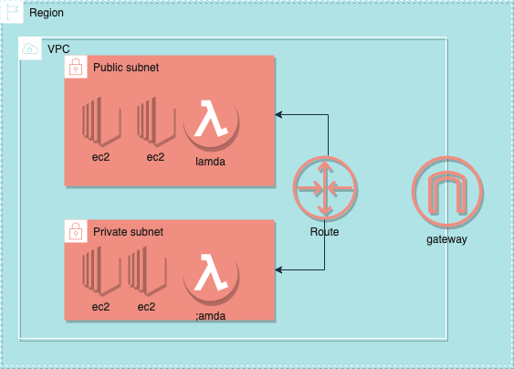

# Aws Global Infrostruct
[AWS全球基础设施](https://aws.amazon.com/cn/about-aws/global-infrastructure/): AWS 云现已在全球 25 个地理区域内运营着 81 个可用区，并宣布计划在澳大利亚、印度、印度尼西亚、以色列、西班牙、瑞士和阿拉伯联合酋长国 (UAE) 新增 21 个可用区和 7 个 AWS 区域。

## Region and Avaliable Zone
[区域和可用区](https://aws.amazon.com/cn/about-aws/global-infrastructure/regions_az/?p=ngi&loc=2)
这里列出列了区域和可用区,在选择区域(Region)是 应该按照业务量,就近的选择区域,如果客户在香港多就选亚洲的Region,如果多数在美国就选择美国的Region
一个Region 一般包括3个Avaliable Zone就相当于三个数据中心,他们之间的距离在100km内.
### Global Service and Regional
在清楚了区域之后,我们需要明确aws提供了2种不同类型的服务,Global Service: Amazon S3,CloudFound, IAM,Route53.
Regional Service: lambda.


### AWS VPC
最主要的还是可以看[官网](https://docs.aws.amazon.com/vpc/latest/userguide/what-is-amazon-vpc.html)的文档介绍
在使用VPC 之前,我们需要了解一些基本的网络协议 [IPV4](../../network/networkLayer.md) ,不能对地址路由这些东西,一脸懵逼.

### 概念
VPC: 是你在AWS的虚拟网络,就像是在aws的虚拟数据中心,它可以分配和隔绝不同云主机. 
为你提供整个网络控制权限,包括了IP ,子网划分,route table 和 gateways 配置,之后你就在可以在你的VPC中启动 EC2 实例,云函数,Dynamic DB 等.

VPC的核心内容:
Region: 是指在页面上选择的地区,香港,华南,华北,纽约什么的都有,我们在一个 Region下可以配置VPC.
一个Region下可以有多个VPC,也可以只有一个.(这完全和钱有关...)
在VPC中可以设置私有subnet 或者公共有subnet.
公网和私网之前要通过路由来通信,需要配置Route map.只有公共subnet 才有公网IP ,才能访问外网.
也可以是多个 vpc 

### CIDR And Subnet:
当你创建一个VPC时,你必须声明IP和子网:

* 子网的数量是有限的所以要确保子网够用
* 考虑一个网络里一个application
* 考虑不同区域间的高可用(HA)
* VPC之间不要重叠

### 推荐设置
• CIDR 的大小最好在 /16 和 /28 之间,修改这个会话费很长时间
• CIDR 块不得与与 VPC 关联的任何现有 CID 块重叠
• 现有的CIDR网络是不能增加或减少网络里设备总数的,所以在设置开始时就应该保证足够大
• 第一个和最后一个IP你自己不能使用,他预留给了aws
• AWS的网络设置参考了[RFC1918](https://datatracker.ietf.org/doc/html/rfc1918)

ranges:
| RFC 1918 Range                                  | Example CIDR Block                                          | 
| ----------------------------------------------- | ----------------------------------------------------------- | 
| 10.0.0.0 - 10.255.255.255 (10/8 prefix)         | Your VPC must be /16 or smaller, for example, 10.0.0.0/16   | 
| 172.16.0.0 - 172.31.255.255 (172.16/12 prefix)  | Your VPC must be /16 or smaller, for example, 172.31.0.0/16 | 
| 192.168.0.0-192.168.255.255 (192.168/16 prefix) | Your VPC can be smaller, for example 192.168.0.0/20(4)      | 
  

• A VPC spans all the Availability Zones in the region
• You have full control over who has access to the AWS resources
inside your VPC
AWS中一个Regiin 下默认可以创建5个VPC
• A default VPC is created in each region with a subnet in each AZ

Routing (CIDR) block; for example, 10.0.0.0/16
255-->/8 

### IPV4 Subnet Creator 
[Tool Collection](https://network00.com)

[IPV4 Subnet Create](https://network00.com/NetworkTools/IPv4SubnetCreator/)

Aws 提供了 vpc wizard

### Credit VPC
点点点, 按照提示点就可以了

1. create vpc
2. create public subnet and private subnet
3. create Route Table
   private Route Table for private subnet
   
   public  Route Table for public subnet
   public  subnet need to assign ip
   
4. create Internet Getway

#### NAT GateWay
NAT GateWay must in public subnet


#### Security Group and Network ACL

Network ACL (Network Access Control) 在子网中过滤流量 ,答到访问控制的效果. 是一种无状态的防火墙
Security Group则是在ec2之前控制访问权限. 就是一些端口配置感觉各种云服务都差不多. 则是由状态的防火墙
ACL的规则设置顺序,可以按照规则number的大小,数字小的先执行
一个典型的VPC设置:

* Configure Security Groups and NACLs

#### EC2 In VPC

当然也可以尝试使用terrorform.
可以通过 AWC CLI ec2 发布到指定网络.

```shell
  aws ec2 run-instances --image-id<AMI-id> -instance-type<>  --security-group-ids<security-group-id> --subnet-id<> -key-name<> 
  --user-data file://<filePath>

```


### VPC Peering
通过IPV4 ,IPV6 地址,连接不同地方的 VPCs,可以是同一个region下的,也可以不在同一个Region,甚至可以不在同一个账号里.

how to config

VPC -> Peering Connections -> Create peering connection

### VPC Endpoints

### VPN client 
aws side to side vpn

AWS VPN CloudHub

aws vpc connect to remote customer office
each office has BGP ASN

- AWS Client VPN: https://www.youtube.com/watch?v=g2JOHLHh4rI&t=1h36m55s
- AWS Site-to-Site VPN: https://www.youtube.com/watch?v=g2JOHLHh4rI&t=1h39m43s
- AWS VPN CloudHub: https://www.youtube.com/watch?v=g2JOHLHh4rI&t=1h41m51s
- AWS Direct Connect (DX): https://www.youtube.com/watch?v=g2JOHLHh4rI&t=1h44m50s
- AWS Direct Connect Gateway: https://www.youtube.com/watch?v=g2JOHLHh4rI&t=1h51m31s
- AWS Transit Gateway: https://www.youtube.com/watch?v=g2JOHLHh4rI&t=1h54m59s
- Using IPv6 in a VPC: https://www.youtube.com/watch?v=g2JOHLHh4rI&t=1h58m54s
- Create VPC Flow Logs: https://www.youtube.com/watch?v=g2JOHLHh4rI&t=2h04m55s


可以配置路由Route Map 53