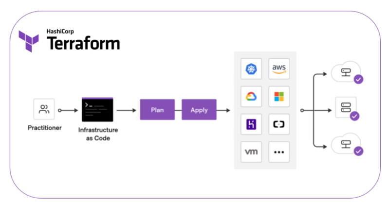
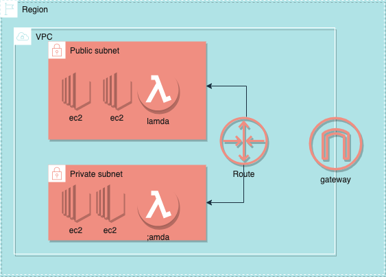

# AWS

https://www.youtube.com/watch?v=SOTamWNgDKc

公司最近开始在使用AWS我在这里记录一下每天使用的过程那么公司最近开始在使用AWS我在这里记录一下每天使用的过程:

## AWS CLI
 
 AWS命令行工具,自己使用时按照[官网](https://docs.aws.amazon.com/cli/latest/userguide/getting-started-install.html)给的方式下载就好了.
 自己公司里是搞到自己的私服了通过 pip intall aws-cli ,可能同官网的不一样.

 命令太多记不住,耗头发,使用的时候参考[手册](https://awscli.amazonaws.com/v2/documentation/api/latest/reference/index.html).
 同时也看看了别云服务上,[华为云CLI](https://support.huaweicloud.com/qs-hcli/hcli_02.html),[阿里云CLI](https://help.aliyun.com/product/29991.html) 用法都差不多,看的明白文档才是王道.
 之后会存一些常用命令

## ADFS

  这个其实就是我们自己实现的一个小工具,原理用python 就打开AWS的登陆页面输入账号密码,选择一个IAM账户,点击登录.
  有个你的session之后通过AWS CLI拿到token, 拿到token信息把aws账户的token写到本地的 ~/.aws/credentials中,大概这个样子


    ```
     [saml]
     output = json
     aws_access_key_id = dummy
     aws_access_key_id = dummy
     region = eu-west-1
     aws_sestion_token = dummy

    ```

## Terrform   
 [官网](https://www.terraform.io/)     
 ### 介绍
 一门脚本语言, 目的是 Infostruct as language(架构作为语言), 简单地说在使用aws的各种组件时一步一步的点击,一步步配置时间久了大家都记不住,所以搞成一些脚本,自己定义比变量,定义组件名字等. 统一管理方便快捷,高端大气有格调.
 [下载地址](https://www.terraform.io/downloads)
 ### 实践
 没什么废话就是,一个地址告诉这东西怎么用:[教程](https://learn.hashicorp.com/collections/terraform/aws-get-started)

 大概步骤:
 


## VPC
https://www.youtube.com/watch?v=g2JOHLHh4rI
最主要的还是可以看 [官网](https://docs.aws.amazon.com/vpc/latest/userguide/what-is-amazon-vpc.html)

在使用VPC 之前,我们需要了解一些基本的网络协议 [IPV4](../network/networkLayer.md) ,不能对地址路由这些东西,一脸懵逼.

VPC的核心内容:
Region: 是指在页面上选择的地区,香港,华南,华北,纽约什么的都有,我们在一个 Region下可以配置VPC.
一个Region下可以有多个VPC,也可以只有一个.(这完全和钱有关...)
在VPC中可以设置私有subnet 或者公共有subnet.
公网和私网之前要通过路由来通信,需要配置Route map.
只有公共subnet 才有公网IP ,才能访问外网.
 
也可以是多个 vpc

### CIDR and subnet:

• A virtual private cloud (VPC) is a virtual network dedicated to your AWS
account
Analogous to having your own data center inside AWS
• It is logically isolated from other virtual networks in the AWS Cloud
• Provides complete control over the virtual networking environment
including selection of IP ranges, creation of subnets, and configuration of
route tables and gateways
• You can launch your AWS resources, such as Amazon EC2 instances, into
your VPC


When you create a VPC, you must specify a range of IPV4 addresses for the VPC in the form of a Classless Inter-Domain
Routing (CIDR) block; for example, 10.0.0.0/16

• A VPC spans all the Availability Zones in the region
• You have full control over who has access to the AWS resources
inside your VPC
• By default you can create up to 5 VPCs per region
• A default VPC is created in each region with a subnet in each AZ


### 推荐设置
• CIDR block size can be between /16 and /28
• The CIDR block must not overlap with any existing CID block
that's associated with the VPC
• You cannot increase or decrease the size of an existing CIDR
block
• The first four and last IP address are not available for use
• AWS recommend you use CID blocks from the FC 1918
ranges:
| RFC 1918 Range                                  | Example CIDR Block                                          | 
| ----------------------------------------------- | ----------------------------------------------------------- | 
| 10.0.0.0 - 10.255.255.255 (10/8 prefix)         | Your VPC must be /16 or smaller, for example, 10.0.0.0/16   | 
| 172.16.0.0 - 172.31.255.255 (172.16/12 prefix)  | Your VPC must be /16 or smaller, for example, 172.31.0.0/16 | 
| 192.168.0.0-192.168.255.255 (192.168/16 prefix) | Your VPC can be smaller, for example 192.168.0.0/20(4)      | 

Ensure you have enough networks and hosts
Bigger CIDR blocks are typically better(more flexibility)
Smaller subnets are OK for most use cases
Consider deploying application tiers per subnet
Split your HA resources across subnets in different AZS
VPC Peering requires non-overlapping CIDR blocks
This is across all VPCS in all Regions/accounts you want to connect
Avoid overlapping (IDR blo as much as possible!

### Credit VPC
点点点


可以通过 AWC CLI ec2 发布到指定网络.
```
aws ec2 run-instances --image-id<> -instance-type<>  --security-group-ids<au> --subnet-id<> -key-name<>  --user-data<>
```

### Security Group and Network ACL

Network ACL (Network Access Control) 在 子网中过滤流量 ,答到访问控制的效果.

需要控制 inbound/outbound 的规则.

Security Group 则是在ec2之前控制访问权限. 就是一些端口配置感觉各种云服务都差不多.


### VPC Peering

连接IPV4 ,IPV6 在不同协议下的VPCs.
可以是同一个 region 下的,
vpc endpionts

aws client vpn
- Create VPC EndPoint: https://www.youtube.com/watch?v=g2JOHLHh4rI&t=1h26m41s
- AWS Client VPN: https://www.youtube.com/watch?v=g2JOHLHh4rI&t=1h36m55s
- AWS Site-to-Site VPN: https://www.youtube.com/watch?v=g2JOHLHh4rI&t=1h39m43s
- AWS VPN CloudHub: https://www.youtube.com/watch?v=g2JOHLHh4rI&t=1h41m51s
- AWS Direct Connect (DX): https://www.youtube.com/watch?v=g2JOHLHh4rI&t=1h44m50s
- AWS Direct Connect Gateway: https://www.youtube.com/watch?v=g2JOHLHh4rI&t=1h51m31s
- AWS Transit Gateway: https://www.youtube.com/watch?v=g2JOHLHh4rI&t=1h54m59s
- Using IPv6 in a VPC: https://www.youtube.com/watch?v=g2JOHLHh4rI&t=1h58m54s
- Create VPC Flow Logs: https://www.youtube.com/watch?v=g2JOHLHh4rI&t=2h04m55s


可以配置路由

AWS IAM user
IAM user 是 root user 创建的,用ID or allias 登陆.
IAM 里可以配置用户组,没个组有一定的权限.
公司给开发都是IAM user 的账户, 没有root 账户

Set up budget
有一个    
没有预算可还行.

MFA


计算网络: 

操作系统:

数据结构:


区块链:
    密码学
         RSA --> 不可逆转 
         DH    

analogous to having you own data center inside aws   
