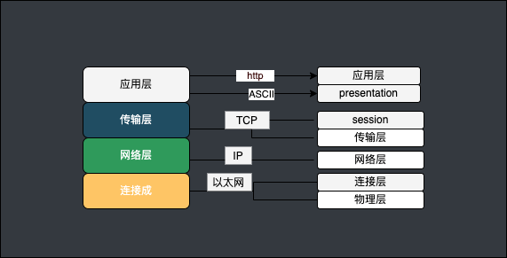
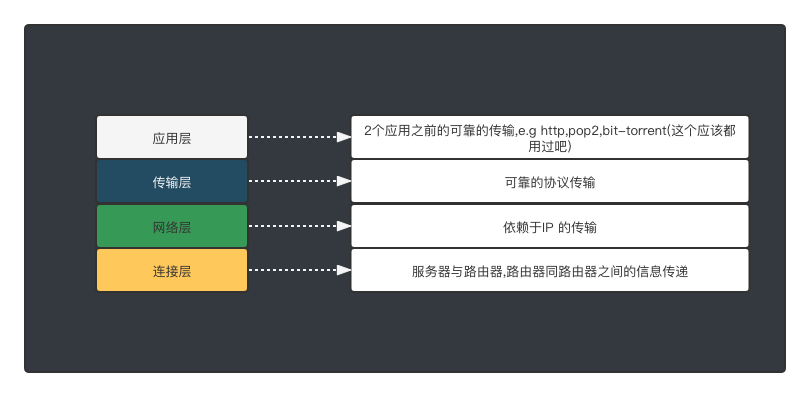
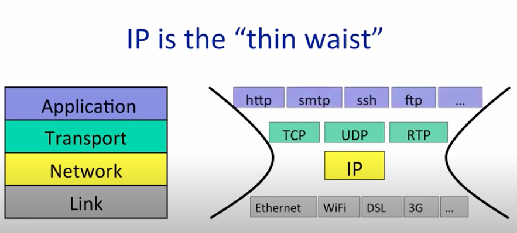

## Network

以前是7 层模型,  后来被4层模型取代了

网络模型:

Application

Transport ( tcp/ip or udp )

Network 层

连接层

7层协议模型与4层的对照关系

### The Internet Protocol (IP)

#### IPV4 Data formate

<table>
    <tr>
        <td width="80">版本号</td>
        <td width="80" > 首部长度</td>
        <td colspan="2"> 服务类型</td>
        <td >数据报长度</td>
    </tr>
    <tr>
        <td colspan="3">16 bit 标识</td>
        <td >标记</td>
        <td >12 bit偏移</td>
    </tr>
    <tr>
        <td colspan="2"> 寿命 (TTL)</td>
        <td>上层协议 
            <a href="https://www.iana.org/assignments/protocol-numbers/protocol-numbers.xhtml">对应关系</a>
        </td>
        <td colspan="3">首部校验和</td>
    </tr>
    <tr>
        <td colspan="5"> 32b Source IP Address</td>
    </tr>
    <tr>
    <tr>
        <td  colspan="5"> 32b Destination IP Addres</td>
    </tr>
    <tr>
        <td  colspan="5">
                option（如果有的话）
        </td> 
    </tr>
    <tr>
        <td colspan="5">
            data
        </td>    
    </tr>
</table>

1. 版本:IP 版本 一般就是IPV4 or IPV6
2. 首部长度:因为IPV4数据报可包含一些可变数量的选项，所以需要用这4bit来确定首部的长度，以确定IP数据报的数据部分实际从哪里开始。大多数IP数据报不包含选项，所以一般IP数据报具有20字节的首部
3. 服务类型(TOS):8 bit
4. 数据报长度
5. 标识, 标记 ,偏移. IP 分片  <https://www.bilibili.com/video/BV1B5411h7t4?p=7&spm_id_from=pageDriver>
6. 用于数据分片,因为可能导致DDOS 在IPV6中已经不在使用.
7. TTL
8. 上层协议
9.  首部校验和
10. 32b source ip
11. 32b destination ip
12. option 可选的字段不一定有使用到.
13. data (有效负载)
   

### IP编地址
IP 的长度应该是32bit

二进制形式: 11001100 11001100 11001100 11001100

为了方便读,记忆写成十进制: 193.32.216.9

#### 子网(subnet)/子网划分

IP 的格式: 由两部分组成，网络号和主机号，其中不同分类具有不同的网络号长度，并且是固定的。

IP 地址 ::= {< 网络号 >, < 主机号 >}

子网掩码: 帮助确定那个是网络地址 ,那个是设备地址.
例如:

  192.168.0.1 
  子网掩码 : 255.255.255.0  ,子网掩码决定了 那部分是network ,那部分是host id
  子网掩码有3位,则代表前3位是 网路号, 最后一位是host id

判断一个IP 是否在同一个网络中则需要知道子网掩码.

例如:

Address1: 

&nbsp;&nbsp;&nbsp;&nbsp;&nbsp; IP:192.168.0.1 
&nbsp;&nbsp;&nbsp;&nbsp;&nbsp; 子网掩码 : 255.255.255.0 

Address2: 

&nbsp;&nbsp;&nbsp;&nbsp;&nbsp; IP:192.168.0.2
&nbsp;&nbsp;&nbsp;&nbsp;&nbsp; 子网掩码 : 255.255.255.0 

Address1 和 Address2, ip不同 ,但是子网掩码相同,则表示同一个区域网络里的2个设备. 

Address3: 
    IP:192.168.0.1 
    子网掩码 : 255.255.255.0 
Address4: 
    IP:192.168.0.2
    子网掩码 : 255.255.0.255

Address3 和 Address4, 则是不是同一区域网络里的2个设备.

子网掩码记录的时候:

因为一个bit 8位,所以 255 就是一个bit,那么就有: 
    255.255.255.0 --> (8 * 3) bit --> 24bit

所以 
    IP:192.168.0.1 
    子网掩码 : 255.255.255.0 
等价于: 192.168.0.1/24

16进制 大端与小端 ,不同的系统架构 会有不同的选择

#### 分类

IP 地址的编址方式经历了三个历史阶段：

- 分类
- 子网划分
- 无分类

| 类型           | 范围 B               | 范围 B                    |
| -------------- | -------------------- | ------------------------- |
| A类 以0开头    | 第一个字节作为网络号 | 0.0.0.0~127.255.255.255   |
| B类 以10开头   | 前两个字节作为网络号 | 128.0.0.0~191.255.255.255 |
| C类 以110开头  | 前三个字节作为网络号 | 192.0.0.0~223.255.255.255 |
| D类 以1110开头 | 一对多的通信         | 224.0.0.0~239.255.255.255 |
| E类 以1111开头 | 保留地址             | 240.0.0.0~255.255.255.255 |

#### 无分类 CIDR
classes interdomain routeing, optimze the ip
Forwarding table is a set to CIDR

回环地址

127.0.0.0/8被用作回环地址，回环地址表示本机的地址，常用于对本机的测试，用的最多的是127.0.0.1。

IPV4  地址 0~255 ,不够用了 . 之后采用了NAT 转换技术.
最终走向IPV6

## MAC address 
mac 地址就是最设备唯一硬件地址

### 路由选择协议

常见的路由选择协议有：RIP协议、OSPF协议。

RIP协议 ：底层是贝尔曼福特算法，它选择路由的度量标准（metric)是跳数，最大跳数是15跳，如果大于15跳，它就会丢弃数据包。

OSPF协议 ：Open Shortest Path First开放式最短路径优先，底层是迪杰斯特拉算法，是链路状态路由选择协议，它选择路由的度量标准是带宽，延迟。

可以通过 TTL 的值来判断, 2个设备之前有多少设备.

### DHCP
获取主机地址

### ARP(address Resolution Protocol)

网络层协议, 可以发现 连接地址关联 网络地址 , 它直接连接了
网卡地址(ethernet card address)  48 bit的16进制数字 e.g 9.9.9.9
硬件mac码

### NAT (network address translate)

NAT 服务器 [网络地址转换（NAT）的原理与配置](https://blog.51cto.com/yangshufan/1959448)

RTP 协议 <https://blog.csdn.net/bripengandre/article/details/2238818>

工具:   [kali工具 recon-ng 的被动信息搜集_twowords的博客-CSDN博客](https://blog.csdn.net/Jaasenyi/article/details/107173402)

### 无线网络
802.11 标准

hypothetical   假想的
hypothetically 假想滴
decoupled with  解偶
wild cards  通配符

partial           部分的

rendezvous  会合

relay

hop                      跳
corruption      腐败

thin waist

voltage

analogy mode   类比模式

postal service

a bare bone service
assumption
concludes
stuck in a loop
brown goes to ocean
controverial and revolutionary idea

assembly code
encapsulate

representation big endian or little endian

Command 

airmon-ng

airmon-ng start InterfacName
