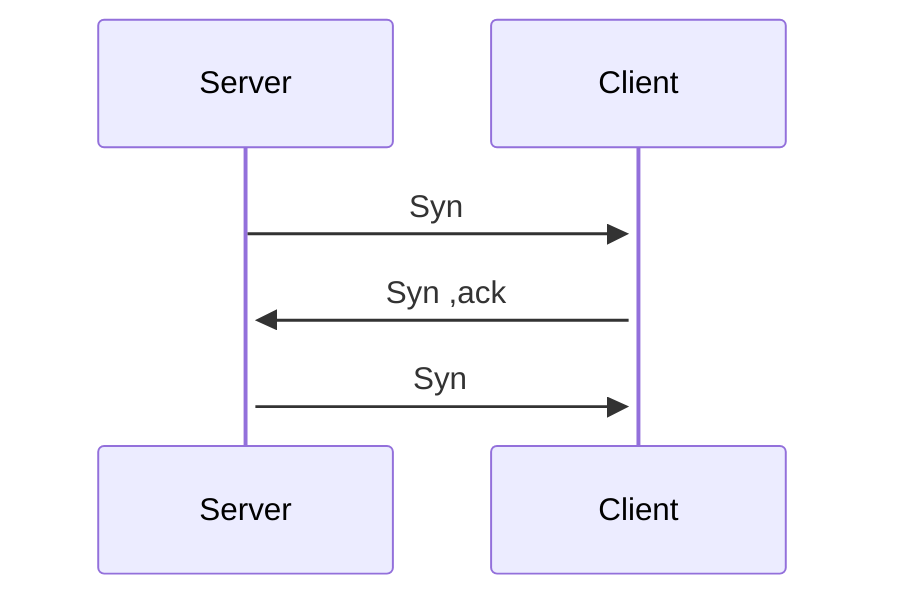
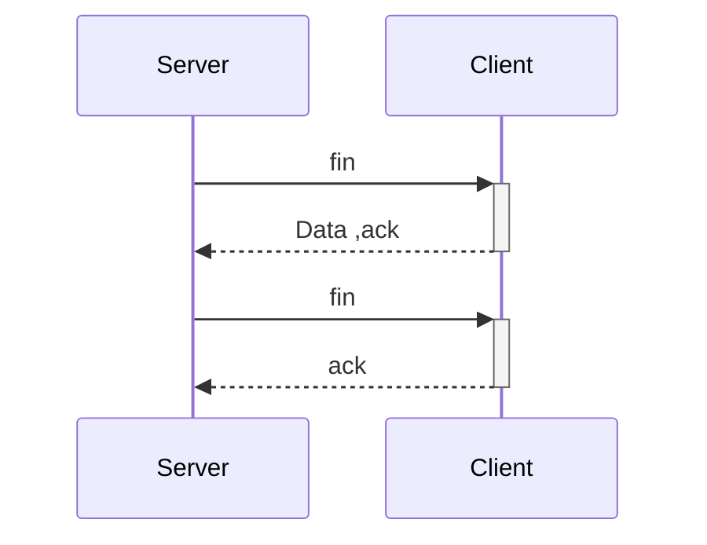

# Transform Layer 传输层
## TCP传输

### TCP 3 次握手 建立tcp连接

192.168.1.2:8080 其中IP 指出了电脑, Port 指出那个application

路由器上也会有一些 ip sending的 pattern ,来匹配发送的地方

tcp [zero window] 数据包

tcp [keep alive] 数据包

### TCP 4次握手 , 断开的过程

### TCP Segment Format

IP Date| Column B | Column C
---------|----------|---------
 Tcp Data  TcpHeader | IP Header

### TCP: port Demultiplexing
tcp中的端口 复用
### TCP Sliding Window
Window-base flow control
#### TCP Retransmission
tcp rst 重设标识
tcp 协议ack 协议包的偏移?
[ TCP 重传技术]
 Tcp 重新传递数据.

### Congestion control
重传计时器.  
若干RTT value 计算 求和, 得到RTO 的value .

## UDP
## UDP Data Format

### UDP:Port 多路复用

So what UDP?

### The Internet Control Message Protocol (ICMP) 
传输层协议
RFC 792 ,ICMP message
ping, traceroute  就是用了 icmp 协议

### End to End 原则
Strong End to End  (RFC 1958)

### Error Detcetion
常用的安全检查算法

1. checksum
   f(data) =  IP checksum
   8 bit checksum
   16 checksum
2. CRCs
   以太网依赖于 CRC

   8 bit  CRC
   16 bit CRC
   32 bit CRC

3. message authentication codes (MAC)

### DHCP协议

应用层协议. 动态主机配置协议,是一个局域网的协议

 DHCP 服务器为客户提供IP地址 :

1.discover  -->广播

2.offer

3.request

4.ack

robust 强大的,鲁棒的

https://wa.me/85259755451/?text=Reward-I5TESTINGQ32200001